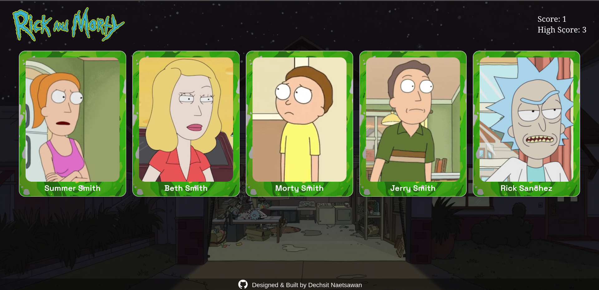

# R&M Memory Card Game : OdinProject Memory Card

**Note:** This website is not mobile responsive yet.

This website was made for the OdinProject's Memory Card assignment. The assignment's purpose was to imrpove on React knowledge from previous CV Application project and learn how to utilize the useEffect hook. In addition, I wanted to try out GraphQL so that became an additional skill obtained here. Credits to [Rick and Morty API](https://rickandmortyapi.com/) for a wonderful and flexible API.

## Live Demo:
[R&M Memory Card Game](https://naetsawd-memorycard.netlify.app/)

## About Website:
The R&M Memory Card Game is a simple game inspired by one of my favorite shows. The goal is to select all the cards while avoiding ones you have previously selected. Cards are shuffled at the start and after each selection. The easy difficult starts you with 5 cards(all the main characters), then medium takes you to 10 cards and finally hard has 15 cards.

## Made Using:
- JavaScript
- HTML5
- CSS3
- Node.js
- Vite
- React.js
- GraphQL(Apollo Client)
